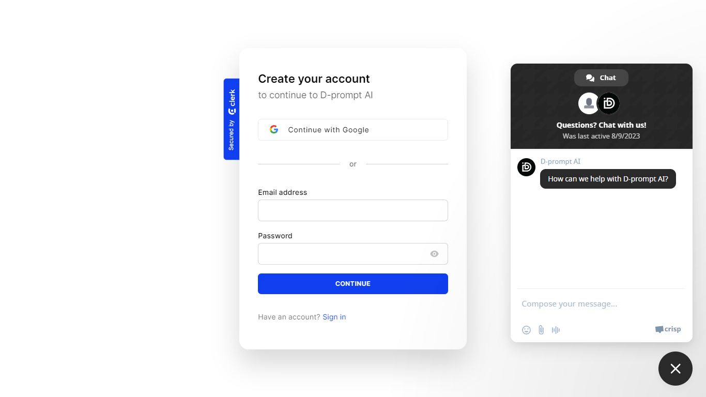

# Drakkar-prompt AI

An Open source AI Generative web-based app, an unprecedented platform that harnesses the boundless potential of artificial intelligence to ignite your creative spark! From dynamic dialogues to spellbinding videos, captivating imagery, harmonious melodies, sophisticated code generation, and a host of other features, our app offers an expansive array of AI services tailored to amplify your creativity.

# Screenshots





# Demo

https://drakkar-prompt-ai.vercel.app/

# Key Features

### ChatGPT Service

Immerse yourself in lifelike conversations with our AI-powered chat service, reminiscent of ChatGPT. Whether seeking companionship or intellectual exchange, our chat function is designed to cater to your conversational needs.

### Video Generation

Embark on a journey of video creation like never before. Our AI-driven video generation service empowers you to craft bespoke videos aligned with your vision and ideas.

### Image Creation

Unleash your inner artist with AI-generated images that defy conventional imagination. Craft visually stunning masterpieces that challenge the limits of artistic expression.

### Music Composition

Let melodies flow seamlessly as our AI composes music resonating with your deepest emotions. From serene tunes to dynamic compositions, our music generation service paves the way for endless auditory exploration.

### Code Generation

Experience the evolution of programming with our AI-backed code generation service. Whether initiating a new project or seeking coding inspiration, our app assists in generating code snippets to expedite your development endeavors.

### Pro Plan Upgrade

Elevate your journey with our Pro plan, offering not only enhanced and unlimited features but also exclusive chat support to ensure you're fully equipped to bring your ideas to life.

### Real-time Chat Support

With integrated real-time chat support, our team of experts is readily available to provide personalized assistance, answer your questions, and guide you through your creative journey.

# Configuration

To run D-propmt AI, you'll need to set up the following environment variables:

### Clerk Configuration

For integrating with Clerk, you should provide these keys:

- `NEXT_PUBLIC_CLERK_PUBLISHABLE_KEY`: Clerk's public publishable key.
- `CLERK_SECRET_KEY`: Clerk's secret key.
- `NEXT_PUBLIC_CLERK_SIGN_IN_URL`: URL for signing in using Clerk.
- `NEXT_PUBLIC_CLERK_SIGN_UP_URL`: URL for signing up using Clerk.
- `NEXT_PUBLIC_CLERK_AFTER_SIGN_IN_URL`: URL to redirect after successful sign-in.
- `NEXT_PUBLIC_CLERK_AFTER_SIGN_UP_URL`: URL to redirect after successful sign-up.

### OpenAI Configuration

For working with OpenAI's API, you'll need:

- `OPENAI_API_KEY`: Your OpenAI API key.

### Replicate AI Configuration

If you plan to use Replicate AI, you'll need:

- `REPLICATE_API_TOKEN`: Your Replicate AI API token.

### Prisma Database Configuration

For connecting to your Prisma database, provide:

- `DATABASE_URL`: URL for your Prisma database.

### Stripe Configuration

If you are integrating Stripe payments, use:

- `STRIPE_SECRET_KEY`: Your Stripe secret key.
- `STRIPE_WEBHOOK_SECRET`: Your Stripe webhook secret.

### Next.js Host and Port Configuration

For your Next.js application:

- `NEXT_PUBLIC_HOST`: The URL of your Next.js application.

### Crisp Chat Support Configuration

If you're using Crisp for chat support:

- `NEXT_PUBLIC_CRISP_WEBSITE_ID`: Your Crisp website ID.

Remember to keep your environment variables secure and avoid sharing them publicly.

# Installation

Install D-promt-AII with yarn

```bash
clone this repo
cd my-project
run: yarn or yarn install
run: yarn run dev (to start the project)
```

## Tech Stack
Drakkarrr/D-prompt-AI is built on the following main stack:
-  [Stripe](https://stripe.com) – Payment Services
-  [Node.js](http://nodejs.org/) – Frameworks (Full Stack)
-  [React](https://reactjs.org/) – Javascript UI Libraries
-  [JavaScript](https://developer.mozilla.org/en-US/docs/Web/JavaScript) – Languages
-  [TypeScript](http://www.typescriptlang.org) – Languages
-  [Autoprefixer](https://github.com/postcss/autoprefixer) – CSS Pre-processors / Extensions
-  [ESLint](http://eslint.org/) – Code Review
-  [Shell](https://en.wikipedia.org/wiki/Shell_script) – Shells
-  [axios](https://github.com/mzabriskie/axios) – Javascript Utilities & Libraries
-  [Yarn](https://yarnpkg.com/) – Front End Package Manager
-  [Next.js](https://nextjs.org/) – Frameworks (Full Stack)
-  [Prettier](https://prettier.io/) – Code Review
-  [Prisma](https://www.prisma.io/) – Object Relational Mapper (ORM)
-  [Zustand](https://github.com/react-spring/zustand) – State Management Library
-  [GitHub Actions](https://github.com/features/actions) – Continuous Integration
-  [Docker](https://www.docker.com/) – Virtual Machine Platforms & Containers


## Contributing

Contributions are always welcome!

See `contributing.md` for ways to get started.

Please adhere to this project's `code of conduct`.
